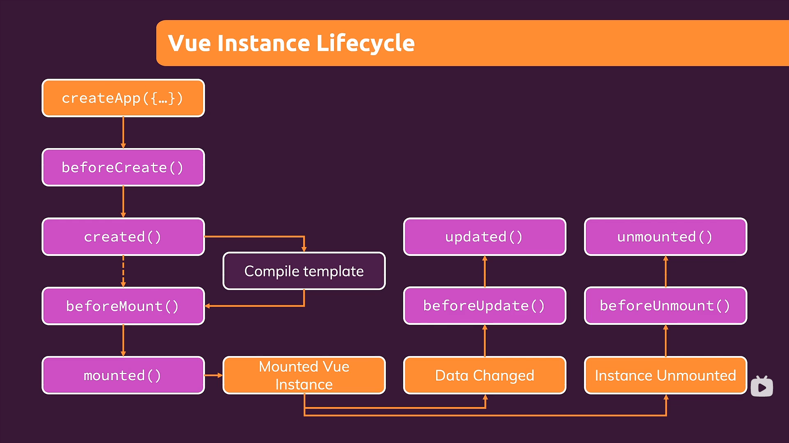

# vue原理
## 数据变化绑定
```
const data = {
  message: "zj",
  longMessage: "",
};
const handler = {
  set: function (target, key, value) {
    console.log(target);
    console.log(key);
    console.log(value);
    if ((key = "message")) target.longMessage = "long" + value;
  },
};
const proxy = new Proxy(data, handler);
proxy.message = "asd";
console.log(proxy.longMessage);
```
## virtual dom
## vue life circle
createApp()->beforeCreate()->created()->beforeMount()->mounted()
